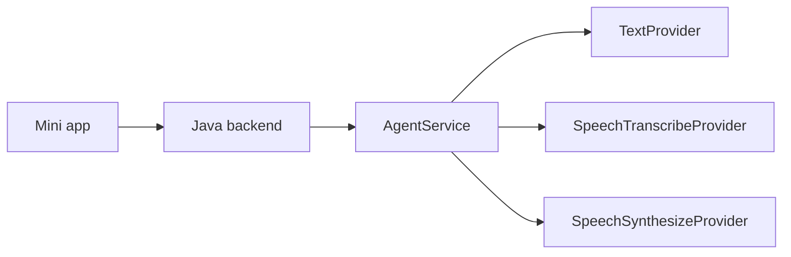

# Agent Provider Architecture

## Overview

The agent layer is split by capability, not by UI flow:

- `TextProvider`
  - chat reply
  - record generation
  - reflection planning/writing
  - memory extraction
  - share card generation
- `SpeechTranscribeProvider`
  - speech to text
- `SpeechSynthesizeProvider`
  - text to speech

The app backend keeps orchestration, sessions, history, and user state.
The Python `nightly-pick-agent` service only implements capabilities.

## Request Flow

### Text input

1. Mini app sends user text to the Java backend.
2. Backend stores the message and builds context.
3. Backend calls the agent `/chat/reply` endpoint.
4. Agent routes the request to the configured `TextProvider`.
5. Backend stores the assistant reply and returns it to the client.

### Voice input

1. Mini app records audio.
2. Audio is uploaded and transcribed through the agent `/speech/transcribe` endpoint.
3. The resulting transcript is sent through the same text reply flow as a normal message.
4. If voice reply is enabled, backend calls `/speech/synthesize`.
5. Mini app plays the synthesized audio.

## Provider Plugin Rules

- Choose providers by capability, not by one global model.
- A single vendor can implement multiple capabilities.
- Text, ASR, and TTS can be replaced independently.
- If a capability is unavailable, use a mock provider instead of blocking the whole app.

## Adding a New Provider

1. Implement the relevant interface in `app/providers`.
2. Register the provider key in `app/providers/registry.py`.
3. Add config values in `app/config.py` if the provider needs credentials.
4. Warm it up in `app/system.py` if startup validation is needed.
